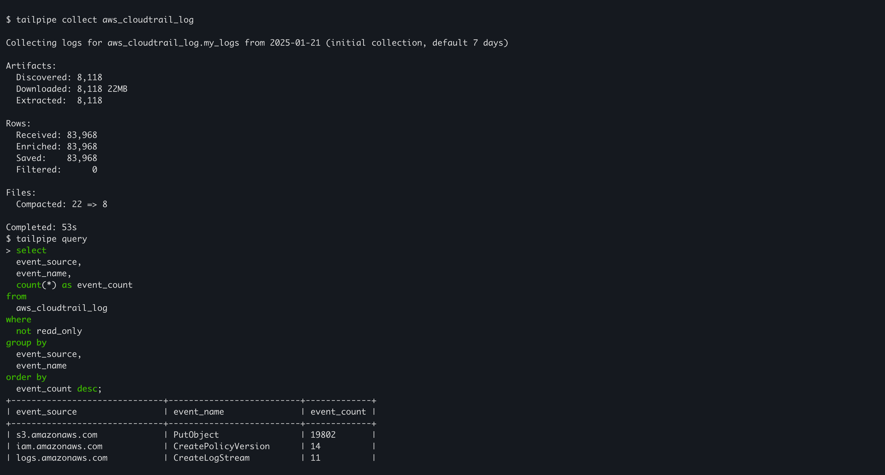
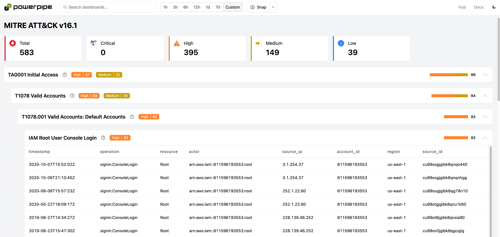

# AWS Plugin for Tailpipe

[Tailpipe](https://tailpipe.io) is an open-source CLI tool that allows you to collect logs and query them with SQL.

[AWS](https://aws.amazon.com/) provides on-demand cloud computing platforms and APIs to authenticated customers on a metered pay-as-you-go basis.

The [AWS plugin](https://hub.tailpipe.io/plugins/turbot/aws) for Tailpipe allows you to collect and query AWS logs using SQL to track activity, monitor trends, detect anomalies, and more!

- **[Get started →](https://hub.tailpipe.io/plugins/turbot/aws)**
- Documentation: [Table definitions & examples](https://hub.tailpipe.io/plugins/turbot/aws/tables)
- Community: [Join #tailpipe on Slack →](https://turbot.com/community/join)
- Get involved: [Issues](https://github.com/turbot/tailpipe-plugin-aws/issues)

Collect and query logs:


Run detections in a dashboard:


## Getting Started

Install Tailpipe from the [downloads](https://tailpipe.io/downloads) page:

```sh
# MacOS
brew install turbot/tap/tailpipe
```

```sh
# Linux or Windows (WSL)
sudo /bin/sh -c "$(curl -fsSL https://tailpipe.io/install/tailpipe.sh)"
```

Install the plugin:

```sh
tailpipe plugin install aws
```

Configure your [connection credentials](https://tailpipe.io/docs/reference/config-files/connection/aws), [table partition](https://tailpipe.io/docs/manage/partition), and [data source](https://tailpipe.io/docs/manage/source):

```sh
vi ~/.tailpipe/config/aws.tpc
```

```hcl
connection "aws" "logging_account" {
  profile = "my-logging-account"
}

partition "aws_cloudtrail_log" "my_logs" {
  source "aws_s3_bucket" {
    connection = connection.aws.logging_account
    bucket     = "aws-cloudtrail-logs-bucket"
  }
}
```

Download, enrich, and save logs from your S3 bucket:

```sh
tailpipe collect aws_cloudtrail_log
```

> [!NOTE]
> When running `tailpipe collect` for the first time, logs from the last 7 days are collected. Subsequent `tailpipe collect` runs will collect logs from the last collection date.
>
> For more information, please see [Managing Collection](https://tailpipe.io/docs/manage/collection).

Enter interactive query mode:

```sh
tailpipe query
```

Run a query:

```sql
select event_source, event_name, count(*) as event_count
from aws_cloudtrail_log
where not read_only
group by event_source, event_name
order by event_count desc;
```

For example:

```sh
+----------------------+-----------------------+-------------+
| event_source         | event_name            | event_count |
+----------------------+-----------------------+-------------+
| logs.amazonaws.com   | CreateLogStream       | 793845      |
| ecs.amazonaws.com    | RunTask               | 350836      |
| ecs.amazonaws.com    | SubmitTaskStateChange | 190185      |
| s3.amazonaws.com     | PutObject             | 60842       |
| sns.amazonaws.com    | TagResource           | 25499       |
| lambda.amazonaws.com | TagResource           | 20673       |
+----------------------+-----------------------+-------------+
```

## Detections as Code with Powerpipe

Pre-built dashboards and detections for the AWS plugin are available in [Powerpipe](https://powerpipe.io) mods, helping you monitor and analyze activity across your AWS accounts.

For example, the [AWS CloudTrail Logs Detections mod](https://hub.powerpipe.io/mods/turbot/tailpipe-mod-aws-cloudtrail-log-detections) scans your CloudTrail logs for anomalies, such as an S3 bucket being made public or a change in your VPC network infrastructure.

Dashboards and detections in this mod and others are written as code, making them easy to customize and adapt to your specific requirements.

To get started, browse the [Powerpipe Mods for the AWS plugin](https://hub.tailpipe.io/plugins/turbot/aws/mods) and follow the instructions provided for each mod.

## Developing

Prerequisites:

- [Tailpipe](https://tailpipe.io/downloads)
- [Golang](https://golang.org/doc/install)

Clone:

```sh
git clone https://github.com/turbot/tailpipe-plugin-aws.git
cd tailpipe-plugin-aws
```

After making your local changes, build the plugin, which automatically installs the new version to your `~/.tailpipe/plugins` directory:

```
make
```

> [!TIP]
> Replace `aws_cloudtrail_log` with your table's name if it's different.

Re-collect your data:

```
tailpipe collect aws_cloudtrail_log
```

Try it!

```
tailpipe query
> .inspect aws_cloudtrail_log
```

## Open Source & Contributing

This repository is published under the [Apache 2.0](https://www.apache.org/licenses/LICENSE-2.0) (source code) and [CC BY-NC-ND](https://creativecommons.org/licenses/by-nc-nd/2.0/) (docs) licenses. Please see our [code of conduct](https://github.com/turbot/.github/blob/main/CODE_OF_CONDUCT.md). We look forward to collaborating with you!

[Tailpipe](https://tailpipe.io) is a product produced from this open source software, exclusively by [Turbot HQ, Inc](https://turbot.com). It is distributed under our commercial terms. Others are allowed to make their own distribution of the software, but cannot use any of the Turbot trademarks, cloud services, etc. You can learn more in our [Open Source FAQ](https://turbot.com/open-source).

## Get Involved

**[Join #tailpipe on Slack →](https://turbot.com/community/join)**

Want to help but don't know where to start? Pick up one of the `help wanted` issues:

- [Tailpipe](https://github.com/turbot/tailpipe/labels/help%20wanted)
- [AWS Plugin](https://github.com/turbot/tailpipe-plugin-aws/labels/help%20wanted)
