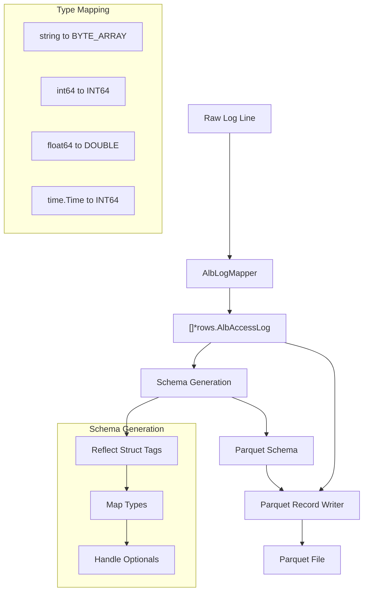
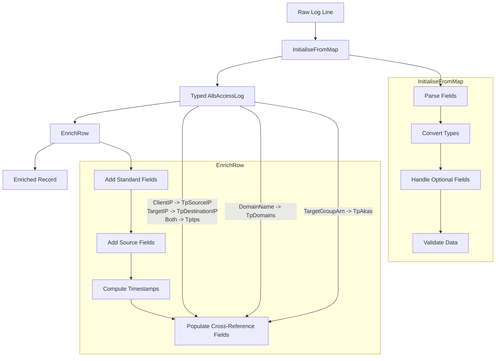

# Overview

Here's the explanation of how ALB logs flow through Tailpipe to become Parquet files. The main benefit of this system is that we just define our struct with the right tags and types, and the SDK handles all the complexity of Parquet file creation. We don't need to write any Parquet-specific code in our table implementation.

## Initial Processing

- Raw log line comes in as a string from S3 or other source
- `AlbLogMapper.Map` parses this into structured data (`[]*rows.AlbAccessLog`)
- The mapper handles all the complex string parsing (quotes, optional fields, etc.)

## Schema Generation
- SDK uses reflection on the `AlbAccessLog` struct
- JSON tags define column names (e.g., `json:"type"` becomes column "type")
- Go types are mapped to Parquet types:
  - `string` → `BYTE_ARRAY`
  - `int64` → `INT64` 
  - `float64` → `DOUBLE`
  - `time.Time` → `INT64` (milliseconds since epoch)
  - Pointer types (e.g., `*string`) become nullable columns
  - Arrays become repeated fields

## Record Writing
- SDK batches records for efficiency (doesn't write one at a time)
- Uses the generated schema to validate data
- Handles type conversion automatically
- Field order in Parquet matches struct field order

## Special Handling
- `CommonFields` embed adds standard columns to every table (`tp_id`, `tp_timestamp`, etc.)
- Timestamps get special treatment - stored as Unix milliseconds for efficiency
- Optional fields (like `TargetIP *string`) only take space when present
- Arrays (like `TpIps []string`) become Parquet repeated fields

### Index Selection (tp_index)

The `tp_index` field is critical for partitioning and querying data efficiently. For ALB logs, we map:

```sql
tp_index = alb_name
```

This means:
- Each ALB's logs are grouped together
- Quick filtering/querying by specific ALB
- Efficient partitioning in data lake storage
- Natural organization matching AWS infrastructure

For example:
```bash
prod-web-alb   → All prod web ALB logs
prod-api-alb   → All prod API ALB logs
staging-alb    → All staging ALB logs
```

This mapping allows queries like:
```sql
-- Get all prod ALB traffic
SELECT * FROM aws_alb_access_log WHERE tp_index LIKE 'prod-%';

-- Compare traffic across environments
SELECT 
    tp_index,
    COUNT(*) as requests,
    COUNT(DISTINCT client_ip) as unique_clients
FROM aws_alb_access_log
GROUP BY tp_index;
```

Alternative index strategies we considered but rejected:
- Account ID: Too broad, most logs from same account
- Region: Too broad, most logs from same region
- Target Group: Too granular, splits related traffic




## Enrichment flow

- Raw Parsing (`InitialiseFromMap`):
  - Converts string values to typed fields
  - Handles empty/optional fields marked with "-"
  - Parses complex fields (IP:port combinations)
  - Reports parsing errors with context
  
- Enrichment (EnrichRow):

  - Adds standard fields (tp_id, tp_timestamp, etc.)
  - Populates cross-reference fields:

    - IPs: Maps client/target IPs to tp_source_ip, tp_destination_ip, tp_ips
    - Domains: Maps domain_name to tp_domains
   - AWS Resources: Maps target_group_arn to tp_akas

 - Computes derived fields (dates, timestamps)
 - Maintains data consistency  
  
The benefit of this separation is that parsing logic stays focused on data conversion, while enrichment logic focuses on adding value. This makes both parts easier to maintain and test independently.



# ALB Log Analysis Queries and Results

## Client Type Distribution
Analyzes the distribution of different client types accessing the application.

```sql
SELECT
    CASE
        WHEN user_agent LIKE '%Mobile%' THEN 'Mobile'
        WHEN user_agent LIKE '%Chrome%' THEN 'Chrome'
        WHEN user_agent LIKE '%Firefox%' THEN 'Firefox'
        WHEN user_agent LIKE '%Safari%' THEN 'Safari'
        WHEN user_agent LIKE '%bot%' OR user_agent LIKE '%Bot%' THEN 'Bot'
        ELSE 'Other'
    END as client_type,
    COUNT(*) as request_count
FROM aws_alb_access_log
GROUP BY client_type
ORDER BY request_count DESC;
```

Results show most traffic comes from "Other" clients (6,337 requests), followed by Mobile (1,842) and Chrome (1,821).

## SSL/TLS Configuration Analysis
Examines the distribution of SSL protocols and cipher suites.

```sql
SELECT
    ssl_protocol,
    ssl_cipher,
    COUNT(*) as count,
    ROUND(COUNT(*) * 100.0 / SUM(COUNT(*)) OVER (), 2) as percentage
FROM aws_alb_access_log
WHERE ssl_protocol != '-'
GROUP BY ssl_protocol, ssl_cipher
ORDER BY count DESC;
```

Key findings:
- TLSv1.2 and TLSv1.3 are evenly distributed
- Most common cipher is TLS_AES_128_GCM_SHA256 (17.21%)
- All modern cipher suites used

## Traffic Distribution by Hour
Shows the distribution of requests across different hours of the day.

```sql
SELECT
    EXTRACT(hour FROM timestamp) as hour_of_day,
    COUNT(*) as request_count
FROM aws_alb_access_log
GROUP BY hour_of_day
ORDER BY request_count DESC;
```

Traffic is relatively evenly distributed between hours 0-14, with a drop-off at hour 15.

## Error Rate Analysis
Examines error rates by hour.

```sql
SELECT
    DATE_TRUNC('hour', timestamp) as hour,
    COUNT(*) as total_requests,
    SUM(CASE WHEN alb_status_code >= 400 THEN 1 ELSE 0 END) as error_count,
    ROUND(SUM(CASE WHEN alb_status_code >= 400 THEN 1 ELSE 0 END) * 100.0 / COUNT(*), 2) as error_rate
FROM aws_alb_access_log
GROUP BY hour
ORDER BY hour;
```

Error rates consistently range between 19-23% across all hours.

## ALB Performance Analysis
Analyzes performance metrics across different ALBs.

```sql
SELECT
    tp_index as alb_name,
    COUNT(*) as request_count,
    COUNT(DISTINCT client_ip) as unique_clients,
    ROUND(AVG(request_processing_time + target_processing_time + response_processing_time), 3) as avg_total_time
FROM aws_alb_access_log
GROUP BY tp_index
ORDER BY request_count DESC;
```

Findings:
- prod-web-alb handles most traffic (3,383 requests)
- staging-alb has higher average processing time (0.523s)
- prod environments maintain better performance (~0.35s)

## Security Analysis

### SQL Injection Attempts
```sql
WITH filtered_requests AS (
    SELECT
        client_ip,
        user_agent,
        request as sample_request,
        timestamp,
        ROW_NUMBER() OVER (PARTITION BY client_ip, user_agent ORDER BY timestamp) AS row_num
    FROM aws_alb_access_log
    WHERE 
        request LIKE '%UNION SELECT%' OR
        request LIKE '%OR 1=1%' OR
        request LIKE '%--\\%' OR
        request LIKE '%'' OR ''%'
)
SELECT
    client_ip,
    user_agent,
    COUNT(*) AS attempt_count,
    STRING_AGG(sample_request, ' | ') AS sample_requests,
    MIN(timestamp) AS first_seen,
    MAX(timestamp) AS last_seen
FROM filtered_requests
WHERE row_num <= 3
GROUP BY client_ip, user_agent
HAVING COUNT(*) > 1
ORDER BY attempt_count DESC
LIMIT 10;
```

Detected multiple SQL injection attempts from IPs in ranges:
- 185.181.x.x
- 193.27.228.x
- 45.155.205.x

### Cross-ALB Attack Patterns
```sql
WITH suspicious_paths AS (
      SELECT
          client_ip,
          user_agent,
          alb_name,
          request as sample_request,
          timestamp,
          ROW_NUMBER() OVER (PARTITION BY client_ip, alb_name ORDER BY timestamp) AS row_num
      FROM aws_alb_access_log
      WHERE
          request LIKE '%actuator%' OR
          request LIKE '%metrics%' OR
          request LIKE '%phpinfo%' OR
          request LIKE '%server-status%' OR
          request LIKE '%jndi:ldap%' OR
          request LIKE '%class.module.classLoader%' OR
          request LIKE '%.env%' OR
          request LIKE '%wp-config%' OR
          request LIKE '%/debug%'
  )
  SELECT
      client_ip,
      user_agent,
      COUNT(DISTINCT alb_name) as albs_targeted,
      COUNT(*) as total_probes,
      STRING_AGG(DISTINCT alb_name, ', ') as targeted_albs,
      STRING_AGG(sample_request, ' | ') as sample_requests,
      MIN(timestamp) as first_seen,
      MAX(timestamp) as last_seen,
      EXTRACT(MINUTES FROM MAX(timestamp) - MIN(timestamp)) as campaign_duration_mins
  FROM suspicious_paths
  WHERE row_num <= 3
  GROUP BY client_ip, user_agent
  HAVING
      COUNT(DISTINCT alb_name) > 1 AND  -- Targeting multiple ALBs
      COUNT(*) >= 3                     -- At least 3 probe attempts
  ORDER BY albs_targeted DESC, total_probes DESC
  LIMIT 10;
```

Key findings:
- Multiple IPs targeting all three ALBs
- Campaign durations ranging from 13 to 54 minutes
- Common attack tools identified: subfinder, WhatWeb, dirbuster, Nmap
- Systematic probing of infrastructure suggesting coordinated attacks

### Notable Attack Patterns
- Sustained campaigns lasting 30+ minutes
- Multiple tools used per attacker
- Systematic targeting of all ALB environments
- Focus on common vulnerabilities (actuator, debug endpoints, config files)


# Testing ALB Log Processing

## Test Data Generation

Testing ALB log processing requires realistic log data that includes both normal traffic patterns and attack scenarios. We use a Python generator script that creates synthetic ALB logs with the following characteristics:

### Normal Traffic
- Distributed across multiple ALBs (prod-web-alb, prod-api-alb, staging-alb)
- Realistic URLs mapped to specific ALBs
- Common user agents (browsers, mobile devices, legitimate API clients)
- Expected HTTP methods and status codes
- Variable response times with production environments being faster

### Attack Patterns
- SQL injection attempts
- Path traversal attacks
- Admin console scanning
- Vulnerability probing
- Traffic from known malicious IP ranges
- Scanner user agents
- Coordinated attack campaigns

### Generator Configuration
The generator supports customization of:
- Number of log lines
- Start date for logs
- ALB names and target groups
- URL patterns
- Attack frequencies
- IP ranges for attackers

## Running Tests

1. First, generate test data:
```bash
python3 alb_generate.py
```

2. Create a test configuration file, e.g.

```hcl
partition "aws_alb_access_log" "alb_test" {
    plugin = "aws"
    source "file_system" {
        paths = ["/home/jon/tpsrc/tailpipe-plugin-aws/test/alb-test.log"]
        extensions = [".log"]
    }
}
```

3. Run Tailpipe:
```bash
TAILPIPE_LOG_LEVEL=debug ./tailpipe collect aws_alb_access_log.alb_test
```

### Key Test Scenarios

When testing ALB log processing, verify:

1. Field Parsing
   - Complex fields (IP:port combinations)
   - Quoted strings with spaces
   - Optional fields marked with "-"
   - Timestamps in correct format

2. Enrichment Logic
   - Standard fields (tp_id, tp_timestamp)
   - IP cross-references (source, destination, list)
   - Domain references
   - AWS resource references (target group ARNs)

3. Error Handling
   - Malformed log lines
   - Missing required fields
   - Invalid field values
   - Incorrect field types

4. Performance
   - Large log file processing
   - Memory usage with batch processing
   - Processing time per record

The included query examples in the previous section can be used to validate the processed data matches expected patterns.