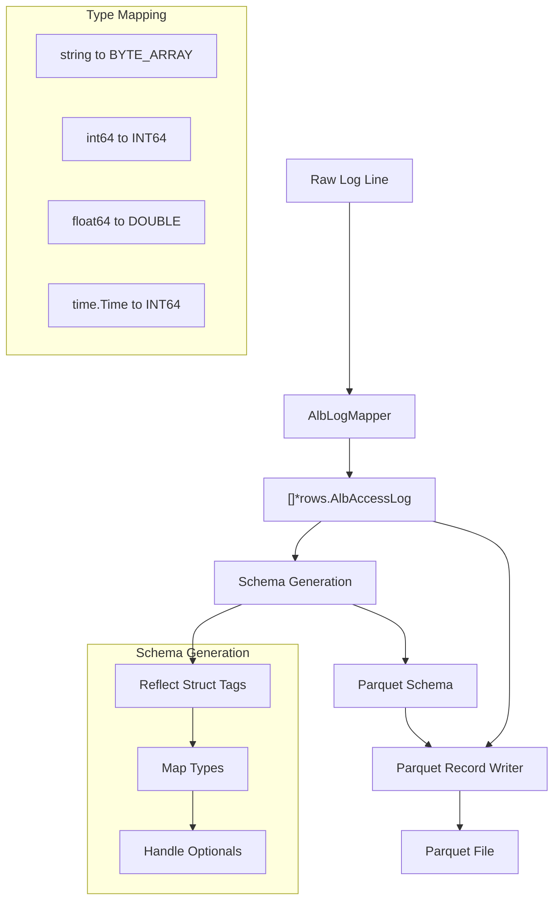
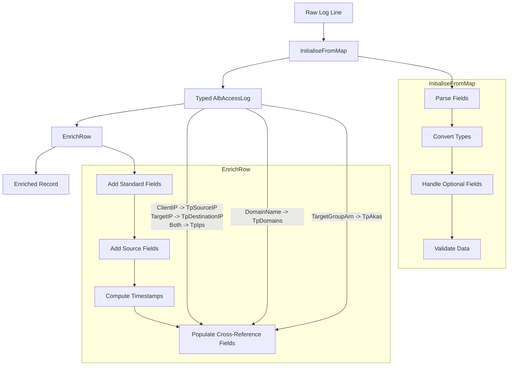

# Overview

Here's the explanation of how ALB logs flow through Tailpipe to become Parquet files:

## Initial Processing

- Raw log line comes in as a string from S3 or other source
- `AlbLogMapper.Map` parses this into structured data (`[]*rows.AlbAccessLog`)
- The mapper handles all the complex string parsing (quotes, optional fields, etc.)

## Schema Generation
- SDK uses reflection on the `AlbAccessLog` struct
- JSON tags define column names (e.g., `json:"type"` becomes column "type")
- Go types are mapped to Parquet types:
  - `string` → `BYTE_ARRAY`
  - `int64` → `INT64` 
  - `float64` → `DOUBLE`
  - `time.Time` → `INT64` (milliseconds since epoch)
  - Pointer types (e.g., `*string`) become nullable columns
  - Arrays become repeated fields

## Record Writing
- SDK batches records for efficiency (doesn't write one at a time)
- Uses the generated schema to validate data
- Handles type conversion automatically
- Field order in Parquet matches struct field order

## Special Handling
- `CommonFields` embed adds standard columns to every table (`tp_id`, `tp_timestamp`, etc.)
- Timestamps get special treatment - stored as Unix milliseconds for efficiency
- Optional fields (like `TargetIP *string`) only take space when present
- Arrays (like `TpIps []string`) become Parquet repeated fields

The main benefit of this system is that we just define our struct with the right tags and types, and the SDK handles all the complexity of Parquet file creation. We don't need to write any Parquet-specific code in our table implementation.

## Enrichment flow

- Raw Parsing (`InitialiseFromMap`):
  - Converts string values to typed fields
  - Handles empty/optional fields marked with "-"
  - Parses complex fields (IP:port combinations)
  - Reports parsing errors with context
  
- Enrichment (EnrichRow):

  - Adds standard fields (tp_id, tp_timestamp, etc.)
  - Populates cross-reference fields:

    - IPs: Maps client/target IPs to tp_source_ip, tp_destination_ip, tp_ips
    - Domains: Maps domain_name to tp_domains
   - AWS Resources: Maps target_group_arn to tp_akas

 - Computes derived fields (dates, timestamps)
 - Maintains data consistency  
  
The benefit of this separation is that parsing logic stays focused on data conversion, while enrichment logic focuses on adding value. This makes both parts easier to maintain and test independently.

