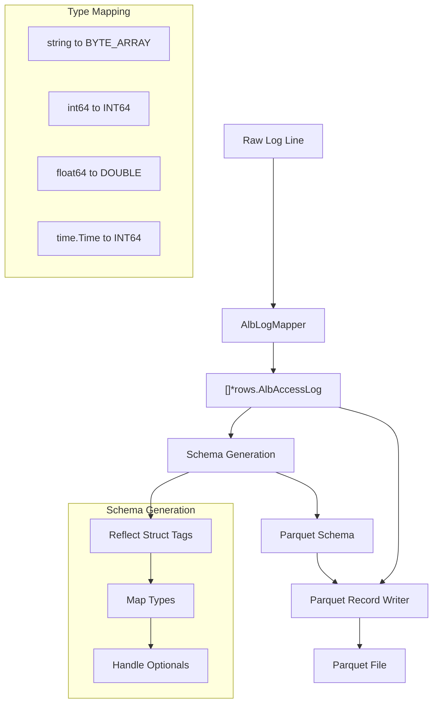

Here's the explanation of how ALB logs flow through Tailpipe to become Parquet files:

1. Initial Processing
- Raw log line comes in as a string from S3 or other source
- `AlbLogMapper.Map` parses this into structured data (`[]*rows.AlbAccessLog`)
- The mapper handles all the complex string parsing (quotes, optional fields, etc.)

2. Schema Generation
- SDK uses reflection on the `AlbAccessLog` struct
- JSON tags define column names (e.g., `json:"type"` becomes column "type")
- Go types are mapped to Parquet types:
  - `string` → `BYTE_ARRAY`
  - `int64` → `INT64` 
  - `float64` → `DOUBLE`
  - `time.Time` → `INT64` (milliseconds since epoch)
  - Pointer types (e.g., `*string`) become nullable columns
  - Arrays become repeated fields

3. Record Writing
- SDK batches records for efficiency (doesn't write one at a time)
- Uses the generated schema to validate data
- Handles type conversion automatically
- Field order in Parquet matches struct field order

4. Special Handling
- `CommonFields` embed adds standard columns to every table (`tp_id`, `tp_timestamp`, etc.)
- Timestamps get special treatment - stored as Unix milliseconds for efficiency
- Optional fields (like `TargetIP *string`) only take space when present
- Arrays (like `TpIps []string`) become Parquet repeated fields

The main benefit of this system is that we just define our struct with the right tags and types, and the SDK handles all the complexity of Parquet file creation. We don't need to write any Parquet-specific code in our table implementation.

